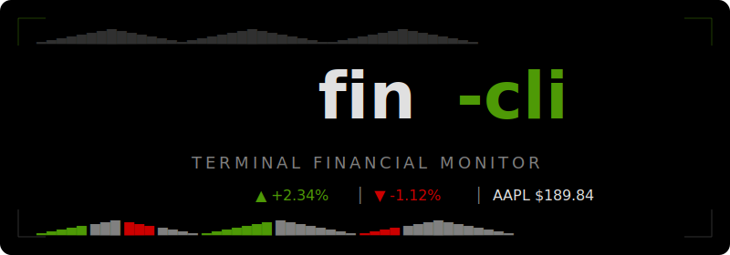
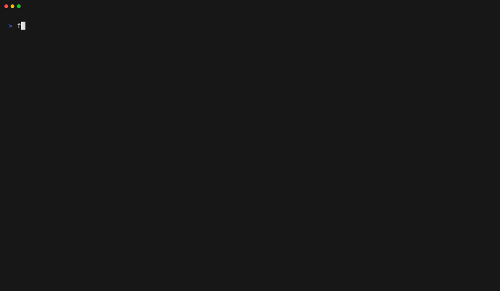

<p align="center">
  
</p>

<p align="center">
  <strong>Linux terminal financial monitor</strong> — watchlist dashboard + one-shot quotes.
</p>

<p align="center">
  <a href="#features">Features</a> ·
  <a href="#install">Install</a> ·
  <a href="#usage">Usage</a> ·
  <a href="#configuration">Configuration</a> ·
  <a href="#providers">Providers</a> ·
  <a href="#keybindings">Keybindings</a> ·
  <a href="#build-from-source">Build</a>
</p>

<p align="center">
  
</p>

---

## Features

- **Interactive TUI dashboard** — watchlist sidebar with sparklines, detail pane with price/change/stats, and 30-session ASCII chart
- **One-shot CLI** — `fin-cli quote AAPL` prints a neofetch-style snapshot to stdout
- **Multi-provider fallback** — Finnhub → Yahoo → Twelve Data → Alpha Vantage, with automatic failover on transient errors
- **Disk cache + singleflight** — fast starts, no duplicate network calls, graceful fallback on errors
- **ISIN resolution** — pass an ISIN (`fin-cli quote US0378331005`) and it resolves to a ticker automatically
- **Interactive settings panel** — edit API keys, polling interval, and provider chains from inside the TUI (`c` key)
- **XDG-compliant** — config, cache, and data follow `~/.config`, `~/.cache`, `~/.local/share`
- **Zero CGO** — static binary, ~9 MB stripped, no runtime dependencies
- **Locale-aware** — autodetects `LC_*`/`LANG` for number formatting; ASCII fallback on `LANG=C`

## Install

### Pre-built binary

Download the latest release from [Releases](https://github.com/msalexms/fin-cli/releases):

```bash
curl -sL https://github.com/msalexms/fin-cli/releases/latest/download/fin-cli_linux_amd64.tar.gz | tar xz -C /usr/local/bin fin-cli
```

### Go install

```bash
go install fin-cli/cmd/fin-cli@latest
```

### Build from source

See [Build from source](#build-from-source) below.

## Usage

### TUI (interactive dashboard)

```bash
fin-cli
```

Opens a full-screen dashboard with your watchlist on the left and instrument detail on the right. Polls every 5 minutes by default.

### One-shot quote

```bash
fin-cli quote AAPL
fin-cli quote US0378331005        # ISIN autodetected
fin-cli quote --isin <ISIN>       # explicit ISIN
fin-cli quote --format=json AAPL  # JSON output
```

### Watchlist management

```bash
fin-cli add AAPL                  # validate + persist
fin-cli add AAPL --no-validate    # skip online check (offline)
fin-cli remove AAPL               # drop from watchlist
fin-cli list                      # print watchlist
fin-cli list --format=json        # JSON output
```

### Configuration

```bash
fin-cli config set finnhub.api_key YOUR_KEY
fin-cli config get finnhub.api_key    # redacted: ****last4
fin-cli config edit                   # open $EDITOR
fin-cli config path                   # print config path
```

### Other

```bash
fin-cli purge                         # clear disk caches
fin-cli export --format=csv           # export watchlist quotes
fin-cli export --format=json -o out.json
fin-cli --debug quote AAPL            # enable debug logging
```

## Configuration

First run writes a commented template to `~/.config/fin-cli/config.toml`.

```toml
schema_version = 2
polling_interval = "5m"
providers = ["finnhub", "yahoo"]
history_providers = ["yahoo"]

[finnhub]
api_key = ""                # env: FIN_CLI_FINNHUB_KEY

[openfigi]
api_key = ""                # env: FIN_CLI_OPENFIGI_KEY

[twelvedata]
api_key = ""                # env: FIN_CLI_TWELVEDATA_KEY

[alphavantage]
api_key = ""                # env: FIN_CLI_ALPHAVANTAGE_KEY

[ui]
sort_mode = ""              # "manual" | "%desc" | "%asc" | "alpha" | "volume"
```

**Key precedence** (highest first): CLI flag → env var → config file.

## Providers

| Provider | Role | Notes |
|---|---|---|
| **Finnhub** | Quote + fundamentals | Primary provider; no candles on free tier |
| **Yahoo** | History (chart) + quote fallback | Unofficial; best-effort; partial data as quote fallback |
| **Twelve Data** | Quote + History | Partial quotes; requires free API key |
| **Alpha Vantage** | Quote + History | Last-resort fallback; harsh daily limit |
| **OpenFIGI** | ISIN resolution | No key needed; higher limit with key |

Provider chains are configurable. Transient errors (network, rate limit, 5xx) advance to the next provider. Terminal errors (not found, bad key) stop the chain.

## Keybindings

### List mode

| Key | Action |
|---|---|
| `↑` / `k` | Previous ticker |
| `↓` / `j` | Next ticker |
| `r` | Force-refresh selected |
| `a` | Add ticker (opens input) |
| `d` | Delete selected |
| `s` | Cycle sort mode |
| `c` | Open settings panel |
| `q` / `Ctrl+C` | Quit |

### Settings panel

| Key | Action |
|---|---|
| `↑` / `↓` | Navigate fields |
| `Enter` | Edit selected field |
| `Enter` (editing) | Save value |
| `Esc` | Cancel edit / exit panel |

### Add input

| Key | Action |
|---|---|
| `Enter` | Validate + persist |
| `Esc` | Cancel |

## XDG Layout

| Path | Purpose |
|---|---|
| `~/.config/fin-cli/config.toml` | API keys, polling interval (perms `0600`) |
| `~/.config/fin-cli/watchlist.toml` | Watchlist tickers (perms `0600`) |
| `~/.cache/fin-cli/quotes/<TICKER>.json` | Per-ticker quote cache |
| `~/.cache/fin-cli/isin/<ISIN>.json` | ISIN resolution cache (30-day TTL) |
| `~/.local/share/fin-cli/fin-cli.log` | Debug log (only with `--debug`) |

All writes are atomic (tmp + rename) with advisory `flock` to prevent corruption from concurrent instances.

## Build from source

### Requirements

- Go 1.23+
- Linux (target platform)

### Production build

```bash
CGO_ENABLED=0 go build -trimpath \
  -ldflags='-s -w -X fin-cli/internal/version.Version=0.1.0' \
  -o fin-cli ./cmd/fin-cli
```

### Dev previews

```bash
go run -tags preview ./scripts/preview         # CLI one-shot render
go run -tags preview ./scripts/preview-tui     # TUI snapshot
```

### Run tests

```bash
go test ./...
go vet ./...
```

## Exit codes

| Code | Meaning |
|---|---|
| 0 | OK |
| 1 | Generic error |
| 2 | Usage / invalid input |
| 3 | Network / provider unavailable |
| 4 | Config / auth |
| 5 | Ticker not found |

## Project structure

```
cmd/fin-cli/main.go                     # Cobra root
internal/
  domain/        types, errors, ports
  providers/     finnhub, yahoo, twelvedata, alphavantage, openfigi
  quotes/        QuoteService (cache + singleflight + chain)
  isin/          ISIN resolver
  watchlist/     Watchlist store
  config/        XDG paths, TOML loader, atomic IO
  cache/         Disk cache
  format/        Shared formatting helpers
  chart/         Chart renderers (blocks, ascii)
  tui/           Bubbletea app (model, update, view, settings, sidebar, detail...)
  cli/           Subcommands + one-shot renderer
  httpx/         Shared HTTP client
  throttle/      Rate limiter
  locale/        Locale autodetect
  logging/       slog + key redactor
  version/       Build-time metadata
```

## License

MIT License. See [LICENSE](LICENSE).
